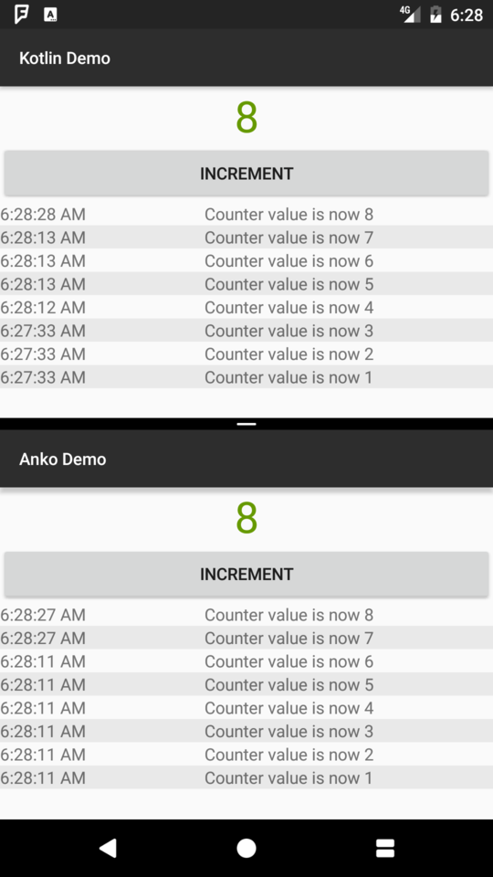

Demo App
===

This is a simple demo app that shows off how to create a simple custom view (a counter) using
Anko, and using XML in Kotlin with Kotlin Android Extensions.

The Anko and XML versions are presented as two different flavors of the same app. The source
for the Anko version is in `app/src/withAnko/java`, and the source for the XML version is in
`app/src/withoutAnko/java`.

You can install the Anko version on your device with `./gradlew :app:installWithAnkoDebug`,
or the XML version with `./gradlew :app:installWithoutAnkoDebug`.

Here is an Android 7.0 device running both versions in splitscreen:

